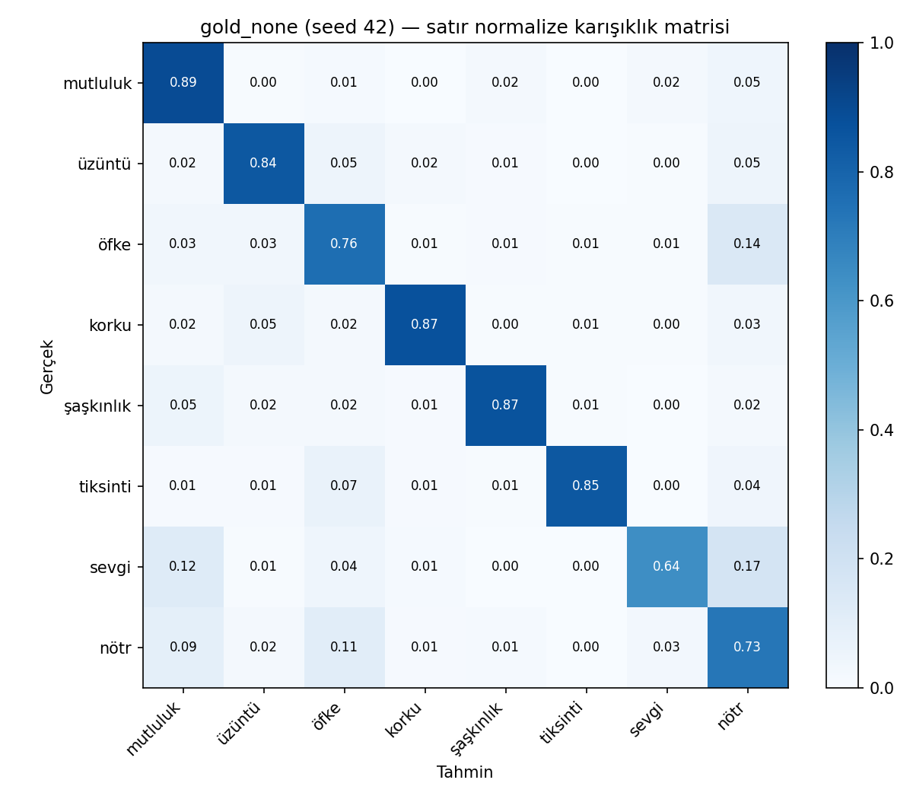

# Faz 5 — İstatistiksel Karşılaştırma ve Hata Analizi

Referans (val F1 ile seçildi): **`gold_none`** — test macro-F1 (seed ortalaması) **0.8122**
Paired bootstrap B=10,000 (test örnekleri ortak yeniden örneklenir, seed'ler ortalanır) · McNemar tam binom testi seed bazında · Holm düzeltmesi

## Referans ile karşılaştırmalar

| Düzen | Seed | Test F1 | Fark (ref − düzen) | %95 GA | p (Holm) | Anlamlı | McNemar p (seed başına) |
|---|---|---|---|---|---|---|---|
| `gold_none_lr1e-5` | 3 | 0.8109 | +0.0013 | [-0.0016, +0.0042] | 0.7312 | hayır | 0.07, 0.31, 0.2 |
| `gold_none_lr3e-5` | 3 | 0.8109 | +0.0013 | [-0.0017, +0.0043] | 0.7312 | hayır | 0.64, 0.024, 0.46 |
| `gold_none_lr5e-5` | 3 | 0.8058 | +0.0064 | [+0.0025, +0.0104] | 0.004 | evet | 0.02, 0.03, 0.0047 |
| `gold_weak` | 3 | 0.8057 | +0.0066 | [+0.0018, +0.0112] | 0.0186 | evet | 0.081, 0.00081, 0.0016 |
| `gold` | 3 | 0.8047 | +0.0075 | [+0.0029, +0.0121] | 0.0064 | evet | 0.013, 0.00091, 0.0019 |
| `xlmr_none` | 3 | 0.7966 | +0.0156 | [+0.0101, +0.0211] | <1e-4 | evet | 0.0025, 2.3e-06, 7.1e-06 |
| `gold_silver` | 3 | 0.7866 | +0.0256 | [+0.0196, +0.0312] | <1e-4 | evet | 6.5e-11, 8.8e-11, 1.7e-15 |
| `mbert_none` | 3 | 0.7796 | +0.0326 | [+0.0259, +0.0393] | <1e-4 | evet | 4.8e-16, 1.5e-17, 2.2e-16 |
| `tfidf_lr` | 1 | 0.7670 | +0.0452 | [+0.0366, +0.0538] | <1e-4 | evet | 4e-25 |

Pozitif fark: referans daha iyi. GA sıfırı içeriyorsa fark istatistiksel olarak ayırt edilemez.

## Kontrollü karşılaştırmalar (tek etken değişir)

Referansla karşılaştırma birden fazla etkeni aynı anda değiştirebilir (ör. `gold_none` − `gold_weak`: hem weak veri hem loss ağırlığı). Tek bir etkenin katkısı aşağıdaki çiftlerle ölçülür (düzeltilmemiş p; planlı karşılaştırmalar).

| A − B | Ölçülen etki | Fark | %95 GA | p (bootstrap) | McNemar p (seed başına) |
|---|---|---|---|---|---|
| `gold_weak` − `gold` | weak veri eklemenin etkisi (ikisi de ağırlıklı loss) | +0.0009 | [-0.0026, +0.0045] | 0.6036 | 0.47, 0.82, 0.58 |
| `gold_silver` − `gold` | silver veri eklemenin etkisi (ikisi de ağırlıklı loss) | -0.0181 | [-0.0234, -0.0126] | <1e-4 | 2.4e-06, 6.8e-05, 7.1e-09 |
| `gold_none` − `gold` | loss ağırlığını kaldırmanın etkisi (ikisi de yalnızca gold) | +0.0075 | [+0.0029, +0.0121] | 0.0016 | 0.013, 0.00091, 0.0019 |

## `gold_none` — kaynak bazlı test F1 (%95 GA)

| Kaynak | n | F1 (kendi sınıfları) | %95 GA |
|---|---|---|---|
| goemotions_tr | 4,775 | 0.6155 | [0.5921, 0.6377] |
| tremo/consensus | 2,660 | 0.9613 | [0.9547, 0.9680] |
| tremo/majority | 855 | 0.8061 | [0.7819, 0.8301] |
| tweet_emotion | 585 | 0.9783 | [0.9684, 0.9878] |

## Hata analizi (`gold_none_s42`, kalibre T=1.1236)

En sık karışan çiftler:

| Gerçek | Tahmin | n |
|---|---|---|
| öfke | nötr | 206 |
| nötr | öfke | 204 |
| nötr | mutluluk | 171 |
| mutluluk | nötr | 102 |
| üzüntü | öfke | 55 |
| üzüntü | nötr | 55 |
| sevgi | nötr | 52 |
| öfke | üzüntü | 49 |
| nötr | sevgi | 48 |
| mutluluk | şaşkınlık | 46 |
| mutluluk | sevgi | 46 |
| öfke | mutluluk | 46 |

| Kaynak | n | Hata | Hata oranı | Yüksek güvenli hata (>0.9) |
|---|---|---|---|---|
| goemotions_tr | 4,775 | 1341 | 0.281 | 74 |
| tremo/consensus | 2,660 | 104 | 0.039 | 20 |
| tremo/majority | 855 | 178 | 0.208 | 36 |
| tweet_emotion | 585 | 13 | 0.022 | 0 |

Örnek hatalar: `errors_sample.csv` (TREMO lisansı gereği yalnızca GoEmotions/tweet metinleri).
